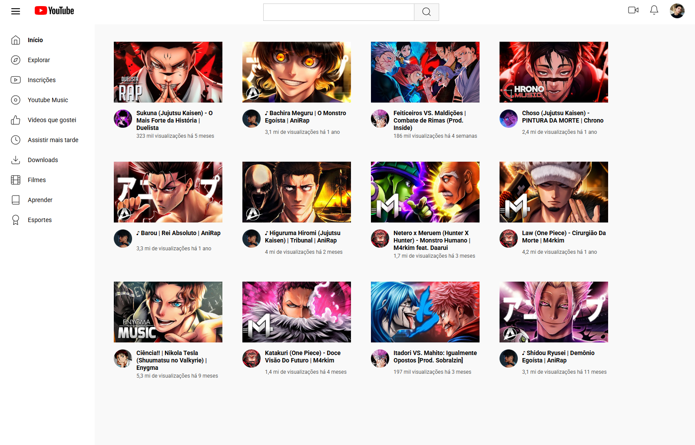

# 🏠 Projeto CSS - Recriação da Página Inicial do YouTube

## 🧩 Sobre o Projeto

Este projeto foi desenvolvido como parte da formação de CSS da [Dio.me](https://www.dio.me/), com o objetivo de praticar **Grid Layout** para estruturar a **página inicial do YouTube** — aquela exibida antes de qualquer pesquisa ser realizada.

A estrutura HTML foi feita manualmente, e o CSS utiliza `display: grid` de forma extensiva para organizar:
- a barra de navegação,
- a sidebar lateral,
- e os blocos de vídeos sugeridos.

## 🎨 Tema do Conteúdo

Para tornar o projeto mais criativo e visualmente interessante, foi adotada uma temática de **rap geek/anime** nos vídeos sugeridos. Thumbnails e nomes de canais foram usados com fins educacionais e não comerciais.

> 🔹 Todo o conteúdo utilizado é público e pertence aos seus respectivos criadores. Este projeto não tem fins lucrativos.

## 💻 Tecnologias Utilizadas

- **HTML5**
- **CSS3**
  - Grid Layout
  - Organização modular com pastas (`assets/css`, `assets/img`)
  - Google Fonts (`Roboto`)

## 📸 Prévia

  
> *Imagem demonstrando a interface inspirada na página inicial do YouTube*

## 🚀 Funcionalidades Implementadas

- Barra de navegação superior com campos de pesquisa e ícones
- Sidebar com categorias do YouTube
- Grade de vídeos sugeridos, cada um com miniatura, canal e informações de visualização

## 🔗 Link para visualização

[🔗 Clique aqui para acessar o projeto online](https://luis-fellipe.github.io/youtube-homepage-css-grid/)

## 🙋‍♂️ Contato

Quer conversar ou saber mais sobre mim? Me chama no LinkedIn!  
[www.linkedin.com/in/luis-fellipe-real](https://www.linkedin.com/in/luis-fellipe-real)

## 📄 Licença

Projeto criado para fins educacionais. Todos os vídeos, nomes de canais e miniaturas utilizados permanecem sob os direitos de seus respectivos autores. Caso algum conteúdo precise ser removido, farei prontamente.
